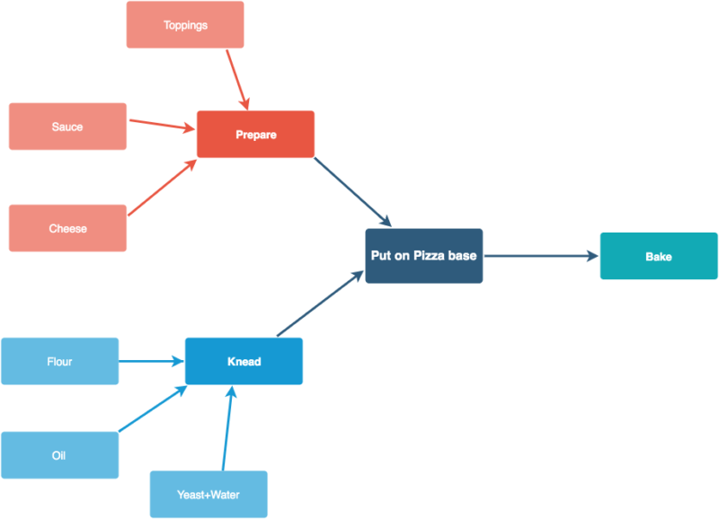
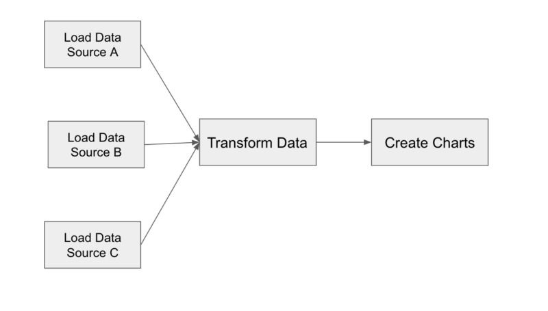

# poly Airflow
Airflow 2.3.2 on Kubernetes

## Summary
[Airflow](https://airflow.apache.org/): is used for the scheduling and orchestration of data pipelines or workflows. Orchestration of data pipelines refers to the sequencing, coordination, scheduling, and managing complex data pipelines from diverse sources. These data pipelines deliver data sets that are ready for consumption either by business intelligence applications and data science, machine learning models that support big data applications.

In Airflow, these workflows are represented as Directed Acyclic Graphs (DAG). Let’s use a pizza-making example to understand what a workflow/DAG is. 

Workflows usually have an end goal like creating visualizations for sales numbers of the last day.  Now, the DAG shows how each step is dependent on several other steps that need to be performed first. Like, to knead the dough, you need flour, oil, yeast, and water. Similarly, for Pizza sauce, you need its ingredients. Similarly, to create your visualization from past day’s sales, you need to move your data from relational databases to a data warehouse.

The analogy also shows that certain steps like kneading the dough and preparing the sauce can be performed in parallel as they are not interdependent. Similarly, to create your visualizations it may be possible that you need to load data from multiple sources. Here’s an example of a Dag that generates visualizations from previous days’ sales. 

